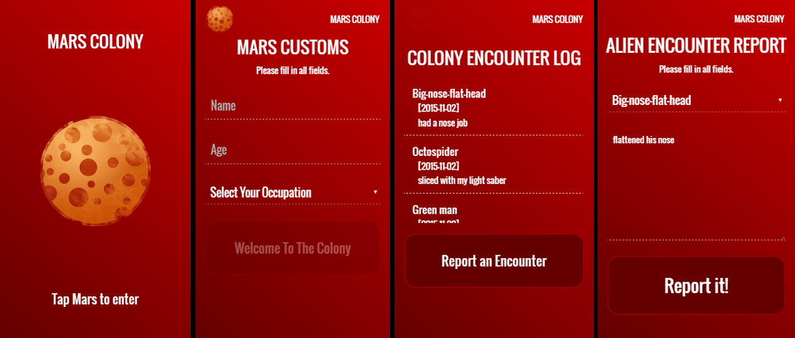

# Mars App Colony



## Description
Learned how to use Angular 2 with typescript to build a single page application. being able to switch from 1 page to the other without loading the whole page but just loading html and also changing the url at the same time. Learned how to get and post data to online API.

## Software:

```
- Sublime Text (editing)
- Chrome (testing)
- GIT Bash (repo upload)
- Angular 2
```

## Technologies Used

```
- html5, css3 , jquery, typescript
- keeping my codes clean, structured, and easy to read
- Used Google Fonts for my webpage's font
- Used GIT Bash to push my local repo to Git Hub
- GET and POST to grab and upload data
```
